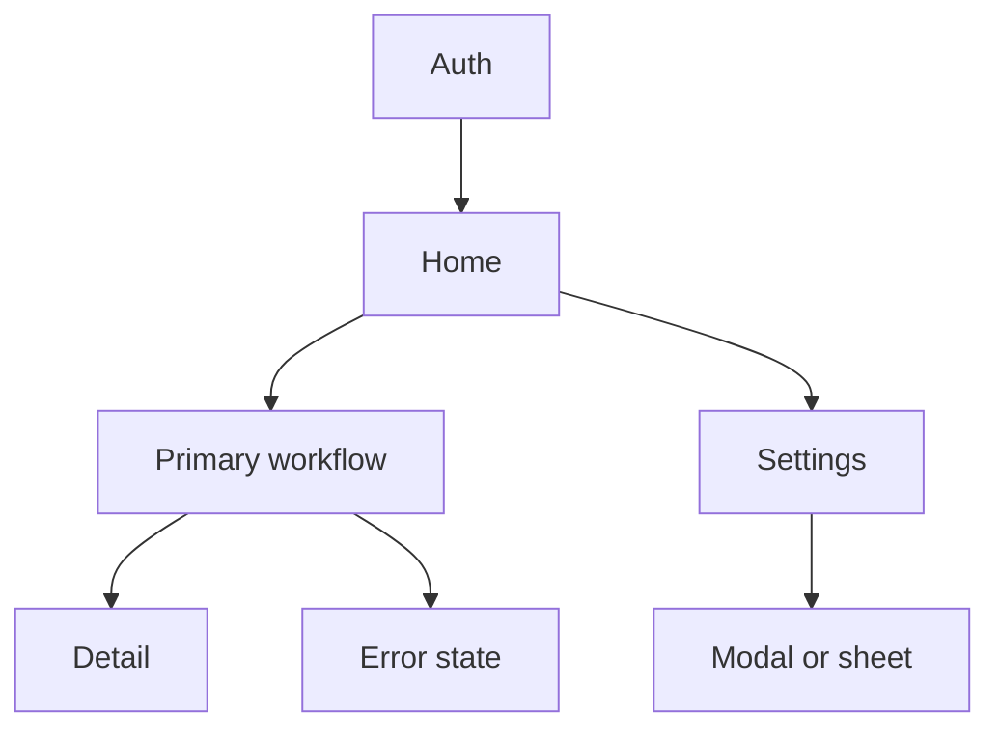

# Interface Inventory report contract

Use this contract when synthesizing the Solvys Kirby handoff. Every required
claim must point to one or more evidence IDs or carry an explicit status such
as `UNKNOWN`, `INFERRED`, or `UNREACHABLE`.

## Package manifest

The report root must contain these files and folders:

```text
INTERFACE_INVENTORY.md
NAVIGATION_MAP.md
DESIGN_TOKENS.md
COMPONENT_INVENTORY.md
LAYOUT_ARCHITECTURE.md
INTERACTION_PATTERNS.md
PL0_ACCEPTANCE.md
EVIDENCE_LEDGER.ndjson
board/WONDER_BOARD.md
evidence/screens/
evidence/flows/
```

`INTERFACE_INVENTORY.md` is the index. It must name the benchmark, scope,
capture window, access role, route list, theme list, breakpoint list, evidence
counts, status legend, coverage gaps, and links to every other file. Include a
semantic page map, accessibility summary, tech-stack clues, observed
inconsistencies or design debt, and a list of measured versus inferred facts.

## Evidence record

Write one JSON object per line in `EVIDENCE_LEDGER.ndjson`:

```json
{
  "capture_id": "CAP-DESKTOP-HOME-DEFAULT-001",
  "kind": "screenshot|flow|recording|measurement|accessibility",
  "source": "https://benchmark.example/app",
  "route": "/app",
  "role": "authenticated-user",
  "viewport": {"width": 1440, "height": 900, "device_pixel_ratio": 2},
  "theme": "dark",
  "state": "default",
  "action": "Opened the dashboard after sign-in.",
  "artifact": "evidence/screens/CAP-DESKTOP-HOME-DEFAULT-001.png",
  "observed_at": "2026-08-06T00:00:00-04:00",
  "status": "MEASURED|OBSERVED|INFERRED|UNKNOWN|UNREACHABLE",
  "notes": ""
}
```

Use a real timestamp and real dimensions in the delivered report. The example
is a schema only. Record screen recordings and flow sequences with their start
and end states, actions, viewport, theme, and motion notes.

## DESIGN_TOKENS.md

Organize the file by token family. Each row must include a stable ID, exact
value, unit or color space, semantic role, observed usage count, usage
frequency method, component or route scope, evidence IDs, confidence status,
and Alpha decision.

Required families:

- Colors: raw hex, RGB, HSL or OKLCH where measurable, plus semantic tokens
  for backgrounds, surfaces, text, accents, borders, hover, active, focus,
  success, warning, error, overlays, scrims, and disabled content.
- Typography: family, source, file or URL, weight, size, line-height,
  letter-spacing, casing, font-feature settings, and text roles from display
  through caption and label.
- Spacing: every observed value, scale grouping, component context, and any
  irregular value that breaks the dominant scale.
- Radii: per component type for buttons, cards, fields, avatars, dialogs,
  sheets, media, and containers.
- Elevation: exact shadow layers, offsets, blur, spread, color, opacity, and
  stacking purpose. Record `none` when the interface uses no shadow.
- Breakpoints: exact resize threshold, changed rules, affected routes, and
  evidence from both sides of the threshold.
- Motion: duration, delay, easing, transition property, keyframe behavior,
  reduced-motion result, and trigger.
- Icons and assets: source, license or permission, dimensions, stroke weight,
  viewBox, avatar rule, image crop, image treatment, and usage location.

Separate raw values from semantic aliases. A raw color may support several
semantic roles, and a semantic role may use different raw values by theme.

## COMPONENT_INVENTORY.md

Create one record for every distinct pattern. Do not collapse two patterns just
because they share a name. Each record must include:

- `component_id` and name.
- Category: global, navigation, buttons and CTAs, forms and inputs, cards and
  list items, dialogs and overlays, menus and popovers, feedback, data display,
  media, or layout primitive.
- Anatomy: parent, child elements, nesting, slots, content rules, and visual
  order.
- Variants: size, hierarchy, color, density, selection, validation, theme,
  icon-only, and product-specific variants.
- States: default, hover, pressed, focus, disabled, loading, skeleton, empty,
  error, success, expanded, modal, overlay, offline, and permission-denied as
  applicable.
- Responsive behavior at each breakpoint and theme.
- Interactions: pointer, keyboard, focus order, shortcut, touch, gesture,
  outside click, escape, submit, cancel, persistence, and navigation.
- Motion: trigger, duration, easing, property, enter, exit, and reduced-motion
  behavior.
- Accessibility: semantic element, role, name, label, description, focus ring,
  contrast, target size, keyboard path, live-region behavior, and ARIA pattern.
- Evidence IDs, exact measurements, inconsistencies, tech clues, approved
  library mapping, protected Alpha ownership, and open questions.

## LAYOUT_ARCHITECTURE.md

Record the page map and every composition rule:

- Grid, flex, CSS grid, intrinsic sizing, alignment, gap, and ordering rules.
- Container max-widths, gutters, safe areas, padding, and full-bleed regions.
- Sticky, fixed, absolute, and portal surfaces with z-index layers.
- Header, footer, sidebar, bottom bar, rail, drawer, modal, and overlay rules.
- Scroll behavior: document, nested, infinite, virtualized, snap, overscroll,
  pull-to-refresh, and scroll restoration.
- Page templates and route-to-template mapping.
- Responsive changes with exact before and after values.
- Overflow, clipping, anchoring, and collision behavior.

Mark a layout rule `INFERRED` when the live evidence shows the effect but does
not reveal the implementation mechanism. Do not claim a CSS implementation
from appearance alone.

## INTERACTION_PATTERNS.md

Start with a state matrix. Use one row for each interactive element and one
column for each state, with the evidence ID or `NOT APPLICABLE` in every cell.
Include:

- default, hover, pressed, focus-visible, disabled, loading, error, success,
  empty, open, expanded, collapsed, selected, checked, invalid, offline, and
  permission-denied.
- entrance and exit behavior, route or page transitions, overlay transitions,
  micro-interactions, keyframe timing, and reduced-motion behavior.
- keyboard navigation, shortcuts, focus restoration, escape, tab order,
  screen-reader announcements, pointer capture, touch, swipe, long-press,
  drag, pinch, and other gestures.
- accessibility audit notes, measured contrast, target dimensions, semantic
  regions, and known failures or debt.

## NAVIGATION_MAP.md

Include a Mermaid chart and a table. The chart must show route or semantic page
nodes, authenticated boundaries, primary navigation, secondary navigation,
modal or overlay paths, and terminal or error states. Link every node to route,
capture IDs, and component or layout IDs in the table.

Example shape:



Replace the example with the benchmark's observed map. Do not leave placeholder
nodes in a final report.

## PL0_ACCEPTANCE.md

Use this structure:

```markdown
# PL0 Acceptance

Status: DRAFT
Revision: 1
Benchmark: <name and URL>
Target Alpha: <product and surface>
Owner: <person or team>
Accepted by: <user or UNKNOWN>
Accepted at: <ISO 8601 timestamp or UNKNOWN>

## Problem and outcome
- Original problem:
- User:
- Desired result:
- Success signal:
- Explicit exclusions:

## Accepted contract
- Tokens: <IDs and values>
- Components: <IDs, anatomy, variants, and states>
- Layout: <IDs and responsive rules>
- Interaction and motion: <IDs and reduced-motion rules>
- Approved library map: <library, block, revision, and owner>

## Intentional divergence from benchmark
...

## Open decisions and proof gates
...
```

The prototype skill may proceed only when `Status: ACCEPTED`, the accepted
contract is complete, and the validator passes with `--require-accepted`.

## Wonder board

`board/WONDER_BOARD.md` is the receipt for the visual board. It must include
the Wonder board URL or ID, capture date, access status, and one grouped list
for each applicable category:

- Global and navigation.
- Buttons and CTAs.
- Forms and inputs.
- Cards, lists, and media objects.
- Dialogs, drawers, sheets, menus, popovers, and tooltips.
- Feedback and data display.
- Media and layout primitives.
- Themes, breakpoints, states, and motion sequences.

Each board item must link to a capture ID and state its viewport, theme, and
state. The board may contain observations and annotations. It may not silently
change the accepted PL0 contract.

## Optional generated outputs

Generate these only when the user requests them or PL0 accepts them as useful
handoff artifacts:

```text
tokens/tokens.dtcg.json
tokens/tailwind.config.ts
tokens/shadcn-theme.css
```

Every generated token file must trace back to accepted token IDs. Do not use a
generated config to introduce a new token, component, or visual decision.
