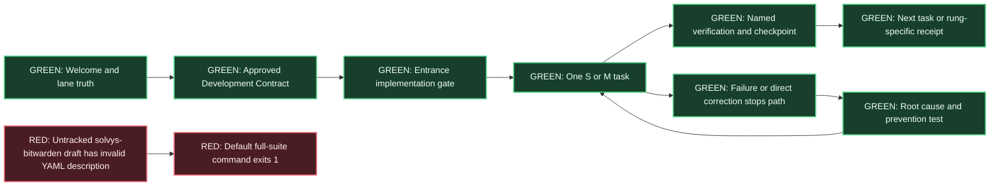

# S014 - Spec-driven development practice repair

Date: 2026-08-11
State: implemented and focused-test verified; global suite blocked by one
unrelated untracked draft skill
Proof rung: tests

## Original problem and outcome

Solvys agents were making too many silent decisions, choosing the wrong source
or work surface, expanding the task shape, and continuing after direct
corrections. Activity existed without enough verified progress.

S014 delivers Factory Development Discipline so each change starts from an
approved behavior contract, proceeds through small verified slices, and stops
the failing path when TP corrects it. The resulting repair records now carry a
failed contract, root cause, prevention test, and stop state.

## Source order and adoption

1. The public [addyosmani/agent-skills](https://github.com/addyosmani/agent-skills)
   repository supplied MIT-licensed patterns for explicit assumptions,
   spec-driven work, small tasks, incremental implementation, test-first
   checks, stop-the-line debugging, scope discipline, and Definition of Done.
   Adoption level: `pattern`.
2. TP's supplied article, *The Spec Is the New Code*, was the final research
   source. S014 adopted separate functional SPEC, technical PLAN, self-contained
   TASKS, Given/When/Then scenarios, living specs, and ceremony proportional to
   risk. Adoption level: `pattern`.

No external repository, package, or generated skill body was installed.

## System map

Plain English: the Factory now checks the destination and work order before the
crew picks up tools. Each room is inspected before the crew enters the next
one. A correction closes the affected room until the fault and its guard test
are handled.

Technical meaning: an approved spec-anchored contract and validated entrance
receipt authorize implementation. Each task has an acceptance reference and
verification command. Correction events are structured and ranked ahead of
routine repair work when they require an immediate stop.

## Correction-language audit

The raw session scan found many literal matches because the same instruction
bundles and quoted policy recur across retained JSONL. These are diagnostic
counts, not infraction counts:

| Token | All raw matches | User-role raw matches |
| --- | ---: | ---: |
| `fucking` | 4,417 | 478 |
| `dumbass` | 721 | 34 |
| `dickhead` | 134 | 22 |
| `stupid` | 332 | 51 |
| `doofus` | 36 | 6 |

The retained event record was then deduplicated by correction mechanism. It
contains 13 distinct friction events. `dickhead` and `doofus` have no distinct
retained correction event after deduplication, so S014 does not invent one.
One event used both `fucking` and `stupid`; token totals overlap.

| ID | Signal | Failed mechanism | Installed prevention control |
| --- | --- | --- | --- |
| C01 | `dumbass` | Used the wrong browser surface | `tool-lane` category, entrance surface truth, and stop-required direct correction |
| C02 | `fucking` | Made a simple job too complex | Functional SPEC, Ponytail reuse chain, and S/M task sizing |
| C03 | `fucking` | Created delegation or task sprawl | One integrator, sequential-by-default tasks, and explicit dependencies |
| C04 | `fucking` | Continued after a stop direction and reopened the wrong desktop path | `stop-command` trigger, immediate path stop, and prevention test before resume |
| C05 | `fucking` | Failed to retry after an external billing state changed | Provider-state recheck in PLAN and checkpoint verification before escalation |
| C06 | `fucking` | Ignored the simplicity, OSS, and low-maintenance preference | Accepted-source record, Ponytail chain, and maintainability boundary |
| C07 | `fucking`, `stupid` | Confused remote branches, storage, and the execution lane | Exact repository/base/SHA fields plus entrance and Cloud-lane validation |
| C08 | `fucking` | Expanded destination scope beyond Kuwait City | Functional domain boundary and Given/When/Then acceptance |
| C09 | `fucking` | Overloaded a newcomer with missing or poorly ordered context | User outcome, assumptions, plain-language system map, and self-contained tasks |
| C10 | `stupid` | Made the written progress note harder than needed | One concise checkpoint per task with outcome, proof, and remaining gate |
| C11 | `dumbass` | Asked before searching the repositories | PLAN current-source and accepted-pattern fields before implementation |
| C12 | `dumbass` | Built a UI/table concept before the real document-prep process | Functional SPEC before technical PLAN or interface implementation |
| C13 | `dumbass` | Used the wrong internal plan taxonomy | Product semantics in SPEC and acceptance scenarios before code |

The universal rule now reads message context. Emphasis, quotations, inherited
instructions, and preferences update constraints. A direct correction, stop
command, explicit infraction, or quality-friction message creates structured
repair work. The ledger stores the mechanism and does not store the insult.

## Implemented controls

- Added a living Development Contract template with separate SPEC, PLAN, and
  TASKS layers and proportional maturity levels.
- Added a dependency-free validator that rejects missing Given/When/Then,
  unresolved questions, draft status, invalid source identity, XL tasks, and
  missing proof commands.
- Linked the contract into entrance and Sprint records. The entrance validator
  now refuses implementation when the contract is missing, stale, or invalid.
- Extended infraction records with trigger kinds, failed contracts, root
  causes, prevention tests, stop requirements, and repair verification state.
- Ranked stop-required repairs ahead of routine severity and death-loop work.
- Promoted the rules into the Factory skill, CAO sequence, communication
  protocol, Operations Handbook, and product-agent system prompt.
- Added focused tests and made the Development Contract checks part of the
  default suite.

## Acceptance and validation

- AC-1: missing or invalid contract blocks implementation in entrance tests.
- AC-2: missing Given, When, or Then fails contract validation.
- AC-3: direct corrections require repair context and enter the stop-required
  queue before routine critical entries.
- AC-4: keyword-only matching is prohibited in loaded doctrine and the recorder
  requires a classified trigger.
- AC-5: the contract requires exact verification and a checkpoint for each
  ordered S or M task.

Validation at `2026-08-11T04:31:11Z`:

- `python3 -m unittest discover -s scripts/tests -p 'test_*.py'`: 11 passed.
- Contract implementation validation: passed with 5 acceptance scenarios and
  6 tasks.
- Entrance implementation validation: passed and authorized S014.
- Changed Factory, CAO, and communication skills: all passed the skill-creator
  validator.
- Installed Codex skill links resolve to this writable source, and byte-for-byte
  readback matched all three changed skills.
- Python compilation for all suite scripts: passed.
- Build Kit validation: passed for 7 components and 5 presets.
- `bash scripts/validate-suite.sh`: exited 1 after five valid skills because
  untracked `.claude/skills/solvys-bitwarden/SKILL.md` has a list-valued TODO
  description. A read-only continuation found this was the only invalid skill;
  every later suite stage passed. S014 did not alter that TP-owned draft.

## Custody and remaining boundary

S014 changed only the files declared in Development Contract revision 3. It did
not modify the existing Build Kit, Pen.dev, Design, Bitwarden draft, screenshots,
provider state, client repositories, or product worktrees. No dependency,
server, preview, Site, commit, merge, or publication was created. The source is
implemented and focused-test verified; global-suite and Git-publication proof
remain red until the unrelated draft is completed or removed by its owner and
the shared dirty branch receives an authorized integration decision.
