# S015 - Solvys Autonomous Delivery System implementation receipt

Date: 2026-08-11
Contract revision: 1
State: local control plane verified; private Site and gateway deployed; Symphony image verified; worker dispatch and human review remain gated
Proof rung reached: deployed private Site and authenticated gateway with runtime-down proof
Required proof rung: deployed private Site plus one isolated Symphony issue

## Outcome

S015 now supplies the local Factory control plane: one managed agency directive,
durable productivity hooks, a pinned Loop Engineering command family, project
loop records, Spec Kit 0.16.2 with a Solvys PL preset, schemas, installers, and
prevention tests for all 13 retained correction mechanisms.

The Symphony runtime and Factory Operations Site source tracks recovered from
the Cloud capacity incident and returned exact checkpoints and open pull
requests. Factory Operations version 3 is deployed with owner-only access and
the Solvys gateway is live on Fly with its bearer, operator, idempotency, audit,
volume, and no-merge boundaries proven. The pinned Symphony image now builds
remotely after two live-build repairs, but the worker remains undeployed until
its scoped OpenAI and GitHub credentials receive action-time approval.

```mermaid
flowchart LR
    A["GREEN: S014 Development Contract"] --> B["GREEN: Spec Kit PL0 to PL5"]
    B --> C["GREEN: Pinned Loop state and budgets"]
    C --> D["GREEN: Productivity hooks and correction latch"]
    D --> E["GREEN: Symphony source and gateway PR"]
    E --> F["GREEN: Owner-only Operations Site source PR"]
    F --> G["GREEN: Private Site and gateway deployed"]
    G --> H["RED: Worker dispatch and human review pending"]

    classDef green fill:#d9f7e5,stroke:#18794e,color:#102a1f;
    classDef red fill:#fde2e2,stroke:#b42318,color:#3b0a08;
    class A,B,C,D,E,F,G green;
    class H red;
```

## Verified implementation

- The canonical agency directive appears once on each managed Factory, role,
  loop, Spec Kit, and project-loop Codex surface. Generated project-loop blocks
  are idempotent.
- SessionStart, UserPromptSubmit, PreToolUse, PostToolUse, and Stop hooks compose
  with the existing Impeccable, Plannotator, and catastrophic-command guard.
- The hook controller has durable run state, correction latches, scope checks,
  safe-path inventory, repeated-failure repair mode, genuine human gates, and
  circuit breakers.
- Loop Engineering 0.1.2 and eight published sibling commands use exact versions
  and npm integrity values. The unpublished loop-sandbox package stays disabled.
- HeirRight, Fintheon, CRED-Cowork, Solvys-2, and Affilia each report Loop Ready
  100/L3, Loop Sync 80, and a tested auto-merge denial. SSFitness remains visible
  with dispatch blocked because no manifest or Cloud project exists.
- Project loop context includes only project identity, sprint, contract,
  authority limits, report-only date, and open infraction fingerprints. It does
  not inject full event descriptions or opaque provider identifiers.
- Spec Kit 0.16.2 is installed through uv from tag v0.16.2. The Solvys preset
  wraps all ten Codex commands and maps work through PL0 to PL5. The S014 mapper
  remains the sole implementation authority.
- The suite contains six versioned S015 schemas and 25 passing tests. The
  Build Kit validator also passes for seven components and five presets.
- Symphony v0.0.2 is pinned to commit
  `653f8b3cc476db03420479ba6f95b2ed7281c401` with a verified archive checksum
  and preserved Apache-2.0 attribution. Its gateway has the exact private API,
  admission, authorization, idempotency, audit, capacity, and no-merge controls.
- Symphony source commit `3b2d924aeba4b18c5a879a5f685a56911dd91b40`
  is published at `refs/sprints/S015/T2/P1` and open as PR 5 against
  `2026-08-11`. Twenty-four gateway and runtime contract tests, lint, Compose
  parsing, TOML checks, shell checks, exact Fly command resolution, and remote
  image build pass. The build proves Symphony `v0.0.2`, Codex CLI `0.147.0`,
  checksum verification, the executable `bin/symphony`, and the final Codex
  app-server command.
- The Factory Operations Site source commit
  `2cb2f71a46845af4bee2a66c2d2fbb18d9c0b59e` is published at
  `refs/sprints/S015/T3/P1` and open as PR 4. Its server contract tests,
  typecheck, Vite build, Site archive, anti-slop scan, and credential scans pass.
- The private Site record `appgprj_6a7b408244888191b8e94751e433e5d1` is active
  and owner-only. Version 3 is live at
  `https://factory-operations-s015.solvys-io.chatgpt.site`; environment revision
  1 contains six required keys, with both sensitive values stored as secrets.
- Fly apps `solvys-s015-symphony` and `solvys-s015-gateway` and their encrypted
  5 GB workspace and 1 GB audit volumes exist in `iad`, with seven-day snapshot
  retention. The gateway release is live with both checks passing.
- The live gateway returns 401 without its service bearer, returns 200 with the
  bearer and operator role, reports `runtime-down` honestly, writes durable
  audit receipts, replays a repeated idempotency key, and exposes no merge route.
- Linear has a dedicated scoped runtime key, the `symphony-ready` label, and
  disposable issue `SOL-392` in the exact Fintheon project. No dispatch has run.

## Factory scan

The contextual correction audit still contains 13 retained mechanisms. Literal
keyword counts remain diagnostic signals. `dickhead` and `doofus` have no
distinct retained correction event, so the Factory does not invent one.

The current project ledger sweep has complete coverage for six registered
projects and eight open entries: two Fintheon, one HeirRight, and five CRED.
Each entry now reaches its owning loop as an ID, fingerprint, category, and
title. Full evidence stays in protected Project Records.

## Exact gates

1. Create and store an S015-scoped OpenAI API key and repository-scoped GitHub
   runtime credential on the private Symphony Fly app. This persistent access
   grant requires TP's action-time approval. The worker image is built, but no
   machine has been released without those credentials.
2. Deploy Symphony, dispatch `SOL-392`, prove its isolated workspace, bounded
   branch, commit, tests, PR, receipt, and denied merge/deploy paths, then leave
   its PR open.
3. The Codex Linear connector needs reauthentication against the existing Fintheon
   workspace. The tested Google account had no workspace, and no replacement
   workspace was created.
4. Codex must show and trust the changed hook set through `/hooks` before hook
   enforcement can count as live proof.
5. The private Site still needs owner-session browser state checks and human
   review. Its unauthenticated boundary already returns 401.

The pinned upstream Symphony lock reports 2026 Hex security advisories during
the remote build. OpenAI's current `main` carries the same affected versions.
This accepted evaluation runtime therefore remains 6PN-only, has no public
service, accepts trusted internal traffic, and stays replaceable; the receipt
does not describe the upstream dependency set as vulnerability-free.

The original exact Symphony variables remain represented in the pinned Fly
configuration. The live split adds `OPENAI_API_KEY` and `GITHUB_TOKEN` for the
worker, plus `SOLVYS_GATEWAY_SERVICE_TOKEN` and the three approved dispatch
artifact secrets for the gateway. Values remain outside source and receipts.

## Validation

- `python3 -m unittest scripts.tests.test_s015_controls -v`: 14 passed.
- `bash scripts/install_s015_toolchains.sh --verify-only`: passed with package
  version, integrity, npm audit, uv source tag, and Spec Kit version checks.
- `bash scripts/validate-suite.sh`: 25 tests passed; all skills valid; S015
  toolchains verified; Build Kit validation passed.
- Five project Loop Doctor checks: healthy, 100/L3.
- Five Loop Sync checks: 80, which meets the rollout threshold.
- Five loop-gate probes: auto-merge denied.
- Daily triage cost check: 69,500 realistic tokens per day, 47,608 with caching,
  100,000 token daily cap, and a kill switch at cap exhaustion.

The local Factory changes remain uncommitted in TP's shared dirty branch. The
two Cloud tracks created scoped commits, checkpoint refs, and open PRs. The
authorized Site and gateway provider releases completed without a merge or
product deployment. S015 did not replace the Cloud tasks or mutate unrelated
Build Kit, Pen.dev, screenshot, or product work.
