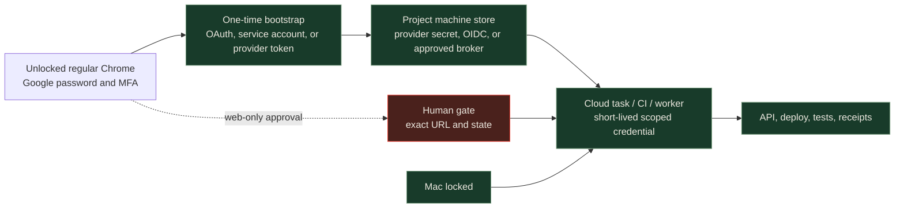

# Solvys machine-auth lane

The Factory uses one human lane and one worker lane. The human lane establishes
authority. The worker lane keeps authorized work moving when the Mac is locked.

## Rules

- Use regular Chrome only for interactive bootstrap and renewal.
- Use project-scoped machine credentials for APIs, deploys, tests, and workers.
- Prefer provider-native secrets and OIDC before adding a new broker.
- Evaluate a self-hosted OSS-aligned broker such as Infisical only after license,
  maintenance, backup, rotation, and exit review.
- Keep Paste as the source reference and human recovery path. Do not make Paste,
  Chrome, or the local Keychain a per-task runtime dependency.
- Google Workspace API access uses minimum-scope OAuth or service-account
  credentials. Domain-wide delegation requires Workspace administrator approval.
- Web-only Google or provider surfaces remain human gates. A headless browser
  may reuse an approved session, but it cannot replace MFA or consent.
- Record names, scopes, issuer, expiry, rotation owner, and proof only. Never
  record secret values, cookies, QR contents, or browser storage.

## Required provider-resource fields

Every project machine-auth record names:

- `authMode`: `oauth-refresh`, `service-account`, `oidc`, `api-token`, or `service-token`
- `issuer` and `audience`
- `scope`
- `secretReference`
- `environment`
- `expiresAt` or rotation interval
- `rotationOwner`
- `humanBootstrapReceipt`
- `workerReadbackReceipt`
- `revocationPlan`

The machine lane reaches `provider-verified` only after the worker reads the
target identity and requested capability from the real provider.
